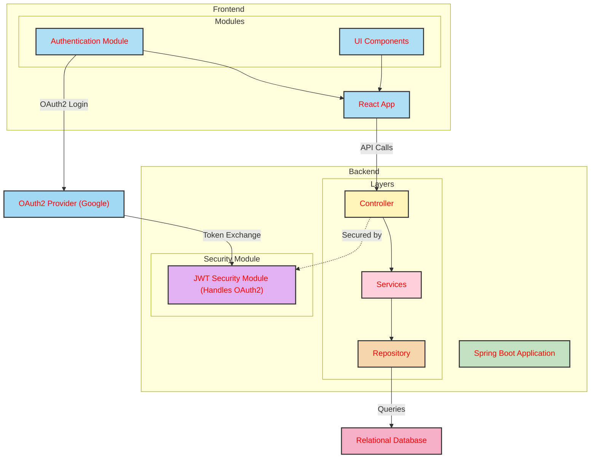
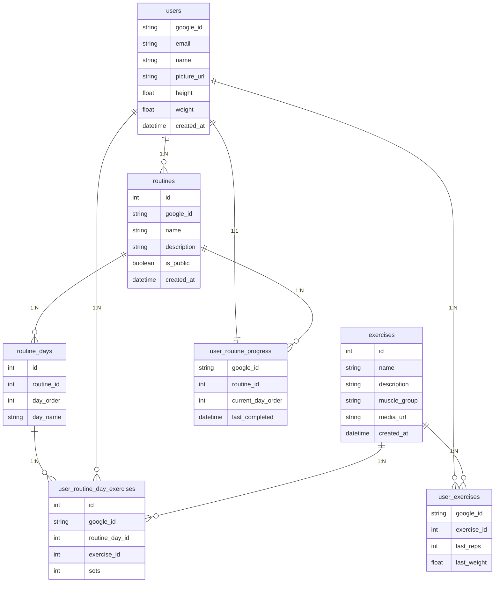

# Work in progress
Documentation 
## Last update

Now you can create custom routines

## How is it organized

```mermaid
flowchart TD
    %% Frontend Components
    subgraph "Frontend"
        direction TB
        ReactApp["React App"]:::frontend
        subgraph "Modules"
            direction LR
            AuthModule["Authentication Module"]:::frontend
            UIComponents["UI Components"]:::frontend
        end
        AuthModule --> ReactApp
        UIComponents --> ReactApp
    end

    %% Backend Components
    subgraph "Backend"
        direction TB
        SpringBootApp["Spring Boot Application"]:::backend
        subgraph "Layers"
            ControllerLayer["Controller"]:::controller
            ServiceLayer["Services"]:::service
            RepositoryLayer["Repository"]:::repository
        end
        subgraph "Security Module"
            JWTSecurity["JWT Security Module (Handles OAuth2)"]:::security
        end
        ControllerLayer --> ServiceLayer
        ServiceLayer --> RepositoryLayer
        ControllerLayer -.->|Secured by| JWTSecurity
    end

    %% OAuth2 Provider
    OAuth2Provider["OAuth2 Provider (Google)"]:::oauth2

    %% Database
    Database["Relational Database"]:::database

    %% Data Flow Connections
    ReactApp -->|"API Calls"| ControllerLayer
    RepositoryLayer -->|"Queries"| Database
    AuthModule -->|"OAuth2 Login"| OAuth2Provider
    OAuth2Provider -->|"Token Exchange"| JWTSecurity

    %% Styles
    classDef default color:red;
    classDef frontend fill:#AEDFF7,stroke:#333,stroke-width:2px;
    classDef backend fill:#C1E1C1,stroke:#333,stroke-width:2px;
    classDef controller fill:#FFF5BA,stroke:#333,stroke-width:2px;
    classDef service fill:#FFD1DC,stroke:#333,stroke-width:2px;
    classDef repository fill:#F7D6AE,stroke:#333,stroke-width:2px;
    classDef security fill:#E2B1F2,stroke:#333,stroke-width:2px;
    classDef database fill:#F7AEC7,stroke:#333,stroke-width:2px;
    classDef oauth2 fill:#A3D8F4,stroke:#333,stroke-width:2px;


```

# ERD

```mermaid
erDiagram
    users {
        string google_id
        string email
        string name
        string picture_url
        float height
        float weight
        datetime created_at
    }

    exercises {
        int id
        string name
        string description
        string muscle_group
        string media_url
        datetime created_at
    }

    routines {
        int id
        string google_id
        string name
        string description
        boolean is_public
        datetime created_at
    }

    routine_days {
        int id
        int routine_id
        int day_order
        string day_name
    }

    user_routine_day_exercises {
        int id
        string google_id
        int routine_day_id
        int exercise_id
        int sets
    }

    user_routine_progress {
        string google_id
        int routine_id
        int current_day_order
        datetime last_completed
    }

    user_exercises {
        string google_id
        int exercise_id
        int last_reps
        float last_weight
    }

    users ||--o{ routines : "1:N"
    routines ||--o{ routine_days : "1:N"
    routine_days ||--o{ user_routine_day_exercises : "1:N"
    users ||--o{ user_routine_day_exercises : "1:N"
    exercises ||--o{ user_routine_day_exercises : "1:N"
    users ||--o{ user_exercises : "1:N"
    exercises ||--o{ user_exercises : "1:N"
    users ||--|| user_routine_progress : "1:1"
    routines ||--o{ user_routine_progress : "1:N"

```
